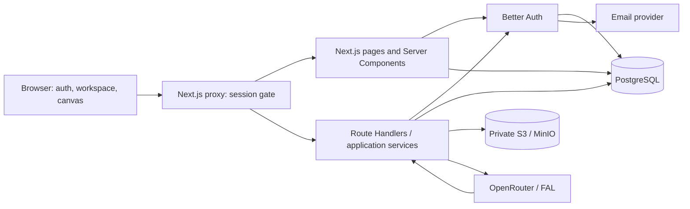

# План реализации backend, авторизации, PostgreSQL и S3

Дата: 2026-07-16

Статус: backend MVP реализован; внешняя production-инфраструктура и email delivery остаются отдельным release-этапом

Источник для переиспользования: [PR #9 — backend](https://github.com/mzhoff/image-prodaction/pull/9), commit `2facdef5056056a2e255106f1317298e92d3b277`

Multi-agent декомпозиция и правила worktree: [backend-multi-agent-execution-plan.md](./backend-multi-agent-execution-plan.md)

## 1. Цель

Довести текущий frontend-прототип до рабочего продуктового контура, в котором пользователь может:

1. зарегистрироваться по email и паролю;
2. получить серверную сессию и оставаться авторизованным после перезагрузки;
3. автоматически получить личный workspace;
4. создать, открыть, переименовать, удалить и восстановить документ;
5. работать в canvas и не терять изменения после обновления страницы или входа с другого устройства;
6. загружать и генерировать изображения, которые сохраняются в S3-совместимом хранилище;
7. выйти и снова войти, увидев свои workspace, документы и ассеты;
8. подтвердить email и восстановить пароль в production-контуре;
9. не иметь доступа к данным другого пользователя или workspace.

План максимально использует код PR #9. Мы не переписываем готовые auth, PostgreSQL, Drizzle, S3 и API-заготовки без причины, но адаптируем их под актуальную продуктовую модель `Workspace → Document → Graph`.

## 2. Зафиксированные архитектурные решения

### 2.1 Backend остаётся внутри Next.js

На этом этапе отдельный NestJS/backend-репозиторий не создаётся. Используем модульный монолит:

- Next.js 16 App Router;
- серверные Route Handlers и Server Components;
- Better Auth;
- PostgreSQL;
- Drizzle ORM и версионируемые SQL-миграции;
- S3-совместимое object storage;
- существующие OpenRouter/FAL/Telegram-интеграции через серверный слой.

Это сокращает стоимость разработки и деплоя. Границы auth, database, storage и AI сохраняются отдельными модулями, чтобы позже их можно было вынести в сервисы без переписывания UI.

### 2.2 Backend становится источником истины

После включения backend:

- пользователи и сессии хранятся в PostgreSQL;
- workspace, участники и документы хранятся в PostgreSQL;
- graph snapshot хранится в `JSONB` с номером версии схемы и ревизией;
- бинарные файлы хранятся в S3;
- PostgreSQL хранит метаданные ассета и его принадлежность workspace/document;
- `localStorage` используется только как временный recovery-cache для несинхронизированного черновика;
- IndexedDB больше не является постоянным хранилищем пользовательских ассетов.

### 2.3 Текущий интерфейс сохраняется

Не заменяем новые экраны авторизации, workspace и `/projects/[projectId]` старыми экранами из PR #9.

Вместо этого:

- подключаем Better Auth к существующей форме;
- сохраняем текущую форму и визуальный дизайн;
- сохраняем публичный интерфейс `useWorkspaceProjects`, заменяя локальную реализацию на backend-вызовы;
- сохраняем маршрут `/projects/[projectId]`;
- адаптируем backend DTO под текущие `WorkspaceRecord` и `ProjectSummary`.

### 2.4 Каноническая сущность — Document

Текущий `ProjectSummary` в UI фактически является файлом canvas. В backend каноническая сущность называется `Document`.

- `Workspace` — пространство пользователя или команды;
- `Document` — файл canvas;
- `Pipeline` — содержимое или исполняемая часть документа, но не верхнеуровневая пользовательская сущность;
- параметр `projectId` в текущем URL временно является идентификатором `Document`.

Так мы не закрепляем устаревшую модель PR #9 `User → Pipeline`.

### 2.5 S3 всегда приватный

Production bucket не должен быть доступен анонимно. Клиент не передаёт `bucket` и `key` при удалении. Он передаёт только `assetId`, а сервер сам находит физический объект, проверяет права и выполняет операцию.

## 3. Что переиспользуем из PR #9

| Блок PR | Решение | Что делаем |
|---|---|---|
| Better Auth server/client | Копируем и адаптируем | Сохраняем библиотеку, Drizzle adapter, email/password и session API |
| `app/api/auth/[...all]/route.ts` | Копируем | Подключаем catch-all auth route к актуальному приложению |
| Auth-таблицы и миграция | Копируем как основу | Сохраняем `user`, `session`, `account`, `verification`; добавляем необходимые поля и новую миграцию |
| PostgreSQL pool | Копируем и усиливаем | Добавляем production-настройки pool, таймауты и проверку соединения |
| `drizzle.config.ts` | Копируем | Подключаем к актуальной schema и scripts |
| `compose.yaml` | Копируем для local dev | Сохраняем PostgreSQL и MinIO, фиксируем версии образов и убираем анонимный bucket |
| `proxy.ts` и session guard | Копируем концепцию | Адаптируем список публичных маршрутов и добавляем handler-level authorization |
| Pipeline CRUD | Используем как шаблон | Сохраняем Zod/Drizzle/ownership-паттерн, заменяем Pipeline на Workspace/Document |
| Pipeline `config JSONB` | Используем | Превращаем в версионируемый `document.snapshot` |
| Backend autosave hook | Адаптируем | Сохраняем debounce/status UI, добавляем revision conflict и recovery-cache |
| S3 client и upload helpers | Копируем как основу | Сохраняем AWS SDK/config, переписываем ownership, validation, URLs и delete |
| AI result → S3 flow | Адаптируем | Сохраняем идею немедленного переноса результата провайдера в наше storage |
| Старые auth/pipeline UI и CSS | Не переносим | Используем актуальные экраны продукта |
| Старые graph/store-файлы целиком | Не переносим | Интегрируем backend в актуальный graph store точечно |
| Старые `package.json` и lock-файл | Не копируем целиком | Добавляем только необходимые зависимости и пересобираем lock-файл |

### 3.1 Коммиты-доноры

- `a95f86f` — Better Auth, PostgreSQL, Drizzle и локальный Compose;
- `04855a3` — защита страниц/API и обязательная сессия;
- `1431838` — S3 и перенос AI-generated images в object storage;
- `2facdef` — CRUD, JSONB и autosинхронизация документов;
- `c595c22` — используем только идеи роутинга, не переносим старый pipeline UI.

Прямой merge или cherry-pick этих коммитов не выполняется: они основаны на старом frontend и затрагивают актуальные UI/store-файлы.

## 4. Целевая архитектура



### 4.1 Границы модулей

```text
app/
  api/auth/[...all]/route.ts
  api/workspaces/route.ts
  api/projects/route.ts
  api/projects/[projectId]/route.ts
  api/projects/[projectId]/snapshot/route.ts
  api/assets/images/route.ts
  api/assets/[assetId]/route.ts
  api/assets/[assetId]/url/route.ts
  api/health/live/route.ts
  api/health/ready/route.ts

src/
  app/api-routes/          # тонкие HTTP handlers
  entities/workspace/      # domain types и API contracts
  entities/document/       # document/snapshot/revision rules
  entities/asset/          # asset metadata и storage contracts
  shared/auth/             # Better Auth и guards
  shared/db/               # Drizzle schema/client/repositories
  shared/storage/          # private S3 adapter
```

Route Handlers работают в Node.js runtime, потому что PostgreSQL, Better Auth и AWS SDK требуют Node.js API. Provider keys и database credentials никогда не передаются в browser bundle.

## 5. Полный пользовательский путь

### 5.1 Регистрация

1. Пользователь открывает `/register`.
2. Вводит имя, email, пароль и принимает условия сервиса.
3. Текущая форма вызывает `signUp.email()` Better Auth.
4. Better Auth создаёт `user`, password account и session.
5. Idempotent onboarding service создаёт:
   - личный workspace;
   - membership с ролью `owner`;
   - при необходимости стартовый пустой document.
6. Пользователь получает HttpOnly session cookie.
7. После успешного onboarding пользователь попадает на `/`.
8. Если production требует verification, доступ к платным AI-операциям блокируется до подтверждения email, но workspace можно показать в ограниченном режиме.

Если onboarding прервался после создания пользователя, следующий запрос с валидной сессией повторяет bootstrap безопасно и без дублей.

### 5.2 Вход и восстановление сессии

1. `/login` вызывает `signIn.email()`.
2. Better Auth проверяет credentials и устанавливает session cookie.
3. `proxy.ts` и server-side guard пропускают пользователя на защищённые страницы.
4. `/` загружает session, workspace и список документов на сервере.
5. После перезагрузки session восстанавливается по cookie без повторного входа.

### 5.3 Первый workspace

1. Для нового пользователя всегда существует минимум один workspace.
2. Пользователь является его `owner`.
3. Workspace page получает initial data с сервера.
4. Текущий `WorkspacePage` продолжает работать через знакомый `useWorkspaceProjects`, но операции идут в API/DB.

### 5.4 Создание и работа с документом

1. Кнопка Create вызывает `POST /api/projects`.
2. Backend проверяет membership и создаёт Document с UUIDv7.
3. UI открывает `/projects/{documentId}`.
4. Сервер проверяет доступ и отдаёт snapshot, revision и asset manifest.
5. Canvas загружает snapshot в существующий Zustand store.
6. Изменения отмечают document как dirty.
7. Через debounce выполняется `PUT /api/projects/{id}/snapshot` с текущей revision.
8. Backend обновляет snapshot только если revision совпала.
9. После успеха UI показывает `Saved`; новая revision сохраняется локально.
10. При конфликте backend возвращает `409`, а UI не перезаписывает чужие изменения молча.

### 5.5 Изображения

1. Пользователь выбирает файл или получает изображение от AI provider.
2. Backend проверяет session, membership, тип, сигнатуру и размер файла.
3. Создаётся Asset row со статусом `pending`.
4. Объект загружается в private bucket.
5. Asset переводится в `ready` и привязывается к workspace/document.
6. UI получает asset DTO и временный signed URL.
7. В graph snapshot хранится `assetId`, но не доверенный клиентом bucket/key.
8. При удалении клиент передаёт `assetId`; backend проверяет права и удаляет объект.

### 5.6 Выход и повторный вход

1. `signOut()` удаляет/инвалидирует session.
2. Защищённые страницы перенаправляют пользователя на `/login`.
3. После повторного входа workspace, документы, snapshots и assets загружаются из backend.
4. Данные доступны на другом устройстве.

### 5.7 Восстановление пароля

1. Пользователь запрашивает reset link.
2. Better Auth создаёт одноразовую verification запись.
3. Email provider отправляет ссылку.
4. Пользователь задаёт новый пароль.
5. Старые сессии инвалидируются по принятой security policy.

## 6. Модель данных

### 6.1 Таблицы Better Auth

Берём из PR #9:

- `user`;
- `session`;
- `account`;
- `verification`.

Дополнительно фиксируем:

- email хранится нормализованным и уникальным;
- timestamps используют единый UTC-подход;
- индексы для session token, userId и verification identifier;
- production migration совместима с зафиксированной версией Better Auth;
- условия сервиса сохраняются как `termsAcceptedAt` и `termsVersion` либо отдельная acceptance table.

### 6.2 Продуктовые таблицы

| Таблица | Назначение | Ключевые поля |
|---|---|---|
| `workspace` | Пространство пользователя/команды | `id`, `name`, `createdAt`, `updatedAt` |
| `membership` | Доступ пользователя к workspace | `workspaceId`, `userId`, `role`, `status` |
| `document` | Файл canvas | `id`, `workspaceId`, `name`, `snapshot`, `schemaVersion`, `revision`, `status`, timestamps |
| `document_preference` | Персональные UI-настройки | `documentId`, `userId`, `favorite` |
| `asset` | Метаданные S3-объекта | `id`, `workspaceId`, `documentId`, `storageKey`, `mimeType`, `sizeBytes`, `status`, timestamps |
| `generation_run` | Учёт AI-операции | `id`, `userId`, `workspaceId`, `documentId`, `provider`, `model`, `status`, `usage`, `cost`, timestamps |

### 6.3 Обязательные ограничения

- unique membership по `(workspaceId, userId)`;
- unique preference по `(documentId, userId)`;
- все запросы document/asset фильтруются через membership;
- soft delete для Document через `status/deletedAt`;
- physical delete выполняется отдельным подтверждённым действием;
- `revision` увеличивается атомарно при каждом snapshot save;
- `schemaVersion` обязателен для миграции старых graph snapshots;
- Asset никогда не определяется по переданным клиентом `bucket/key`;
- индексы по workspace, user, document, status и updatedAt.

## 7. API-контракты

Все input/output contracts описываются Zod-схемами и общими TypeScript DTO. В production клиент не получает необработанные database/S3 errors.

| Method | Endpoint | Назначение |
|---|---|---|
| `GET/POST` | `/api/auth/[...all]` | Better Auth |
| `GET` | `/api/workspaces` | Доступные workspace пользователя |
| `POST` | `/api/workspaces` | Создание workspace после появления team mode |
| `GET` | `/api/projects?workspaceId=` | Список Document DTO для текущего UI |
| `POST` | `/api/projects` | Создание документа |
| `GET` | `/api/projects/[projectId]` | Document snapshot и metadata |
| `PATCH` | `/api/projects/[projectId]` | Rename, status, trash/restore |
| `DELETE` | `/api/projects/[projectId]` | Подтверждённое физическое удаление |
| `PUT` | `/api/projects/[projectId]/snapshot` | Idempotent autosave с revision |
| `POST` | `/api/assets/images` | Проверенная загрузка изображения |
| `GET` | `/api/assets/[assetId]/url` | Короткоживущий signed URL |
| `DELETE` | `/api/assets/[assetId]` | Удаление после ownership check |
| `GET` | `/api/health/live` | Процесс приложения жив |
| `GET` | `/api/health/ready` | PostgreSQL и обязательные зависимости готовы |

### 7.1 Общий authorization pipeline

Каждый защищённый handler проходит три уровня:

1. `proxy.ts` отсекает запросы без session;
2. `requireApiSession()` получает валидного пользователя;
3. `requireWorkspaceMembership()` проверяет право на конкретный resource.

`proxy.ts` не считается единственной границей безопасности. Проверка владения всегда выполняется внутри application service/repository.

### 7.2 Формат ошибок

```json
{
  "error": {
    "code": "DOCUMENT_REVISION_CONFLICT",
    "message": "Документ был изменён в другой сессии.",
    "requestId": "...",
    "details": {}
  }
}
```

Минимальная taxonomy:

- `UNAUTHORIZED` — 401;
- `FORBIDDEN` — 403;
- `NOT_FOUND` — 404;
- `VALIDATION_ERROR` — 400;
- `DOCUMENT_REVISION_CONFLICT` — 409;
- `UPLOAD_TOO_LARGE` — 413;
- `UNSUPPORTED_MEDIA_TYPE` — 415;
- `RATE_LIMITED` — 429;
- `INTERNAL_ERROR` — 500 без утечки внутренних деталей.

## 8. Интеграция с текущим frontend

### 8.1 Auth screen

Текущая `AuthPage` сохраняется. Требуемые изменения:

- controlled fields для name/email/password/terms;
- вызов `signUp.email()` и `signIn.email()`;
- server error mapping;
- pending/disabled state;
- redirect только после подтверждённого auth result;
- session check при открытии `/login` и `/register`;
- реальный `signOut` в меню пользователя;
- Google button скрывается feature flag до настройки OAuth, чтобы не оставлять неработающую кнопку.

### 8.2 Workspace screen

Сохраняем интерфейс hook:

```ts
useWorkspaceProjects()
```

Меняем реализацию:

- initial workspace/projects приходят с сервера;
- create/rename/favorite/trash/restore/delete вызывают backend;
- optimistic UI допускается только с rollback при ошибке;
- `hydrated` означает готовность server data, а не чтение localStorage;
- hard reload не должен показывать фиктивного John/демо-проекты авторизованному пользователю.

### 8.3 Canvas и autosave

- при открытии project сервер проверяет membership;
- snapshot импортируется существующим механизмом project portability;
- Zustand остаётся runtime store редактора;
- backend sync подписывается только на persistable graph/document state;
- selection, hover и transient runtime state не вызывают лишние записи;
- debounce начинается с 2–5 секунд и уточняется после замеров;
- `saving/saved/error/conflict/offline` видны пользователю;
- локальный recovery snapshot очищается только после успешного backend save;
- уход со страницы с pending save показывает предупреждение или выполняет надёжный flush.

### 8.4 Asset model

Текущий `AssetRecord` адаптируется так, чтобы обязательным был `assetId`, а signed URL являлся временным presentation field.

Graph snapshot не должен считать URL стабильным идентификатором. После истечения URL клиент запрашивает новый по `assetId`.

## 9. Этапы реализации

### Этап 0. Подготовка безопасной интеграции

Оценка: 0.5 дня.

Работы:

- завершить и зафиксировать текущие локальные изменения отдельным осмысленным коммитом;
- обновить локальный `main`;
- создать обычную integration branch от актуального `main`;
- не использовать worktree без отдельного разрешения;
- зафиксировать commit PR #9 как donor reference;
- составить точный список файлов для переноса.

Готово, когда:

- рабочее дерево чистое;
- текущий frontend проходит `typecheck`, tests и build;
- интеграционная ветка не содержит случайных изменений.

### Этап 1. PostgreSQL, Drizzle и local infrastructure

Оценка: 1 день.

Переиспользуем:

- `compose.yaml`;
- `drizzle.config.ts`;
- `src/shared/db/client.ts`;
- auth migrations и scripts;
- env-переменные из PR.

Дорабатываем:

- версии PostgreSQL/MinIO фиксируются, `latest` не используется;
- MinIO bucket остаётся private;
- добавляются healthchecks;
- pool получает connect/query/idle timeouts;
- добавляются `db:generate`, `db:migrate`, `db:check`;
- `.env.example` разделяет local и production значения;
- приложение корректно сообщает об отсутствующей runtime configuration.

Готово, когда:

- `docker compose up` поднимает PostgreSQL и MinIO;
- миграции применяются к пустой БД;
- повторное применение безопасно;
- приложение устанавливает соединение и readiness это подтверждает.

### Этап 2. Better Auth и сессии

Оценка: 2 дня.

Переиспользуем:

- auth server/client;
- catch-all route;
- Better Auth Drizzle schema;
- session guards;
- `proxy.ts`.

Дорабатываем:

- подключаем текущие `/login` и `/register`;
- добавляем onboarding workspace;
- создаём `requireSession`, `requireApiSession`, `requireWorkspaceMembership`;
- задаём public route allowlist;
- реализуем logout;
- удаляем фиктивный submit/redirect;
- скрываем неготовый Google OAuth;
- включаем безопасные cookie настройки для production;
- добавляем базовый auth rate limit.

Готово, когда:

- новый пользователь регистрируется;
- session переживает reload;
- пользователь видит только защищённый workspace;
- logout закрывает доступ;
- API без session возвращает 401;
- пользователь A не может использовать session пользователя B.

### Этап 3. Workspace, membership и Document API

Оценка: 2–3 дня.

Переиспользуем:

- Drizzle CRUD patterns из pipeline API;
- `JSONB config` как основу snapshot;
- UUIDv7 helper;
- Zod validation;
- filtering по владельцу как идею.

Дорабатываем:

- создаём product schema;
- заменяем direct `pipeline.userId` на workspace membership;
- добавляем Document repository/service;
- реализуем list/create/read/rename/trash/restore/delete;
- добавляем revision-based snapshot save;
- не возвращаем `userId` и внутренние DB-поля без необходимости;
- добавляем pagination-ready contracts;
- ограничиваем максимальный размер snapshot.

Готово, когда:

- CRUD работает через БД;
- soft delete и restore сохраняют данные;
- cross-workspace доступ запрещён;
- параллельный save со старой revision получает 409;
- malformed/oversized JSON не сохраняется.

### Этап 4. Подключение workspace и canvas

Оценка: 2–3 дня.

Переиспользуем:

- текущий `WorkspacePage`;
- текущий `useWorkspaceProjects` interface;
- project portability/normalization;
- Zustand store;
- debounce/status ideas из PR #9.

Дорабатываем:

- server initial data;
- API-backed workspace operations;
- загрузку snapshot по projectId;
- autosave с revision;
- sync status;
- error/conflict/retry UX;
- local recovery-cache;
- 404/403 состояния project route.

Готово, когда:

- пользователь создаёт документ и открывает canvas;
- изменения сохраняются без ручного export;
- reload восстанавливает актуальный graph;
- повторный login и другое устройство видят документ;
- offline/save error не приводит к молчаливой потере данных.

### Этап 5. Private S3 и assets

Оценка: 2–3 дня.

Переиспользуем:

- AWS SDK client;
- S3 env configuration;
- file naming helpers;
- image dimension extraction;
- AI result upload flow;
- MinIO local environment.

Дорабатываем обязательно:

- private bucket;
- Asset DB table;
- storage key формата `workspaces/{workspaceId}/documents/{documentId}/{assetId}.{ext}`;
- allowlist `png/jpeg/webp/gif` на первом этапе;
- content signature validation;
- file/request size limits;
- download timeout и max bytes для provider result;
- protection от private/local network fetch;
- signed URLs с коротким TTL;
- delete только по `assetId`;
- ownership check;
- pending/ready/failed lifecycle;
- cleanup orphan/pending assets;
- корректная обработка S3 ошибок.

Готово, когда:

- файл доступен только авторизованному участнику workspace;
- прямой публичной ссылки на bucket нет;
- пользователь B не может прочитать/удалить asset пользователя A;
- oversized и unsupported файлы отклоняются;
- AI-generated image сохраняется в нашем S3 до ответа UI;
- удаление document не оставляет бесконтрольные объекты.

### Этап 6. Production auth completeness и безопасность API

Оценка: 2 дня плюс подключение внешнего email provider.

Работы:

- email verification;
- password reset;
- session revocation policy;
- rate limits для login/register/AI/upload;
- trusted origins и production base URL;
- security headers;
- request ID и structured error logging;
- защита от brute force;
- terms acceptance recording;
- квота на размер workspace/assets;
- базовый `generation_run` и учёт AI вызовов.

Готово, когда:

- verification/reset проходят end-to-end;
- auth и AI routes имеют лимиты;
- внутренние ошибки и секреты не попадают клиенту;
- подозрительные запросы можно найти по requestId.

### Этап 7. Tests, CI и production deployment contour

Оценка: 3–4 дня.

Работы:

- backend unit/integration tests;
- E2E critical user journey;
- GitHub Actions;
- `output: 'standalone'` для Next.js;
- multi-stage Dockerfile с non-root user;
- production health/readiness;
- release migration command;
- staging environment;
- secrets через hosting secret store;
- database/object storage backup policy;
- error monitoring и structured logs;
- deploy/rollback runbook.

Готово, когда:

- PR не может быть смержен при failed typecheck/test/build;
- Docker image запускается локально и на staging;
- migration выполняется перед rollout один раз;
- readiness не пропускает трафик при недоступной БД;
- rollback не требует ручного восстановления файлов.

### Этап 8. Миграция локальных данных и rollout

Оценка: 1–2 дня в зависимости от объёма legacy assets.

Работы:

- обнаруживать localStorage projects после первого backend login;
- показывать пользователю предложение переноса;
- импортировать snapshots через валидируемый backend contract;
- переносить IndexedDB assets в S3 с progress;
- не удалять local data до подтверждённого server save;
- сохранять migration report;
- после стабильного периода отключить localStorage как source of truth.

Готово, когда:

- пользователь не теряет старые локальные документы;
- повторный import не создаёт дубли;
- частичный сбой можно безопасно повторить.

## 10. Стратегия тестирования

### 10.1 Unit tests

- Zod schemas и error mapping;
- snapshot size/schema validation;
- document revision rules;
- workspace role checks;
- S3 key generation;
- MIME/signature validation;
- provider URL protection;
- local-to-backend migration mapping;
- auth UI state helpers.

### 10.2 Integration tests с PostgreSQL и MinIO

- registration создаёт user/session/workspace/membership;
- повторный onboarding не создаёт дубли;
- login/logout/session expiration;
- document CRUD;
- revision conflict;
- soft delete/restore;
- cross-user isolation;
- image upload/read/delete;
- S3 failure после создания pending Asset;
- migration up на пустой БД;
- последовательное применение всех migrations.

### 10.3 E2E critical path

Обязательный сценарий:

1. Register;
2. Enter workspace;
3. Create project;
4. Open canvas;
5. Add/change node;
6. Wait for Saved;
7. Upload image;
8. Reload;
9. Sign out;
10. Sign in;
11. Verify document and image;
12. Open second user session and verify access denial.

### 10.4 Existing regression suite

Все существующие graph/node/import/export тесты остаются hard gate. Перенос persistence не должен ломать node contracts, undo/redo и project portability.

## 11. CI/CD и среды

### 11.1 Pull request pipeline

Для каждого PR:

1. `npm ci`;
2. `npm run typecheck`;
3. `npm test`;
4. backend integration tests с service PostgreSQL/MinIO;
5. `npm run build`;
6. migration check;
7. Docker build после появления Dockerfile.

### 11.2 Среды

- `local` — Docker Compose PostgreSQL + MinIO;
- `staging` — отдельные PostgreSQL, private S3, email sandbox, реальные session cookies;
- `production` — managed PostgreSQL/private S3, production domain/email/secrets/backups.

### 11.3 Deployment sequence

1. Backup/restore point;
2. Build immutable image;
3. Apply forward-compatible migrations;
4. Deploy application;
5. Wait for readiness;
6. Run smoke tests;
7. Shift traffic;
8. Observe auth/API/save error rates;
9. Roll back app image if smoke/metrics fail.

Destructive migrations не выполняются в одном release с удалением старого кода. Сначала добавляем новое поле/таблицу, переносим данные, переключаем приложение и только в отдельном release удаляем старое.

## 12. Feature flags и постепенное включение

Рекомендуемые server-side flags:

- `AUTH_REQUIRED`;
- `BACKEND_DOCUMENTS_ENABLED`;
- `S3_ASSETS_ENABLED`;
- `LOCAL_PROJECT_IMPORT_ENABLED`;
- `GOOGLE_AUTH_ENABLED`.

Порядок включения:

1. local development;
2. staging и тестовые пользователи;
3. production internal beta;
4. новые production users;
5. миграция существующих пользователей;
6. удаление legacy persistence после периода стабильности.

Flags не должны позволять обойти authorization. Они управляют доступностью функции, а не security checks.

## 13. Наблюдаемость и эксплуатация

Минимум для production:

- structured JSON logs;
- requestId в каждом API request/error;
- userId/workspaceId только как технические идентификаторы без email и секретов;
- error monitoring;
- latency/error rate по auth, document save, upload и AI;
- PostgreSQL connection saturation;
- S3 error/latency;
- количество pending/failed assets;
- backup PostgreSQL;
- lifecycle/versioning policy для S3;
- документированная проверка восстановления backup.

Не логировать:

- пароли;
- session tokens/cookies;
- Better Auth secret;
- provider API keys;
- полные пользовательские prompts/assets без отдельного основания.

## 14. Риски и способы снижения

| Риск | Последствие | Мера |
|---|---|---|
| Прямой merge PR #9 | Потеря актуального frontend и конфликт store | Только file-level port в новой ветке |
| Pipeline вместо Document | Повторная миграция модели | Сразу ввести Workspace/Membership/Document |
| Autosave last-write-wins | Потеря изменений | Revision + 409 + recovery UX |
| Public S3 | Утечка пользовательских файлов | Private bucket + signed URLs |
| Delete по bucket/key | Удаление чужого объекта | Delete только по assetId после membership check |
| Большой JSON/file | Memory/DB abuse | Body limits, schema validation, quotas |
| Ошибка S3 после DB insert | Pending/orphan asset | Asset lifecycle и cleanup job |
| Ошибка onboarding | Пользователь без workspace | Idempotent bootstrap на signup/first session |
| Локальные данные исчезнут | Потеря MVP-проектов | Явная повторяемая migration flow |
| Нет email provider | Нет verification/reset | Email sandbox на staging, production provider до release |
| Долгие AI-запросы | Timeout/двойная генерация | GenerationRun/idempotency; queue — следующий обязательный scale step |

## 15. Границы первого production release

Входит:

- email/password registration;
- login/logout/session;
- email verification и password reset;
- личный workspace и owner membership;
- Document CRUD и trash/restore;
- backend autosave;
- private S3 assets;
- доступ с другого устройства;
- user/workspace isolation;
- tests, CI, Docker/staging, health, backups и monitoring minimum.

Не входит в первую поставку:

- приглашения участников;
- полноценная админ-панель ролей;
- Google OAuth до получения credentials и product decision;
- billing;
- сложные realtime collaborative edits;
- несколько активных app instances с shared Next.js cache;
- полноценный worker/queue кластер.

При этом schema `membership` создаётся сразу, чтобы team mode не потребовал переделки ownership.

## 16. Общая оценка последовательности

Для одного опытного full-stack разработчика ориентир составляет 13–18 рабочих дней:

- фундамент и auth: 3–4 дня;
- domain DB/API и frontend sync: 4–6 дней;
- S3/security: 3–4 дня;
- tests/CI/deploy/migration: 3–4 дня.

Это предварительная инженерная оценка. Она не включает ожидание production-доступов, DNS, email provider и согласование hosting/S3 vendors.

## 17. Внешние решения, которые не блокируют старт

До production release нужно выбрать:

- managed PostgreSQL provider;
- S3-compatible storage provider;
- hosting/container runtime;
- transactional email provider и отправляющий домен;
- error monitoring;
- backup retention policy.

Локальную реализацию можно начинать до этих решений благодаря PostgreSQL + MinIO из PR #9 и provider-neutral interfaces.

## 18. Definition of Done всего backend-контура

Работа завершена, когда одновременно выполняются условия:

- пользователь реально регистрируется и входит;
- HttpOnly session защищает страницы и API;
- workspace создаётся автоматически и не дублируется;
- документы сохраняются в PostgreSQL и открываются с другого устройства;
- autosave не перезаписывает более новую revision;
- assets находятся в private S3 и доступны только участникам workspace;
- cross-user access тестируется и запрещён;
- verification/reset работают через production email;
- локальные проекты можно безопасно импортировать;
- existing frontend tests, backend tests, typecheck и build проходят в CI;
- staging проходит полный E2E user journey;
- production имеет health/readiness, migrations, secrets, backups, logs и rollback procedure;
- в UI не остаётся кнопок, которые имитируют auth/storage без реального backend-вызова.
