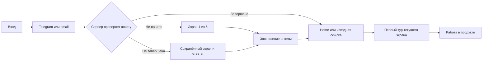

# Первый вход: авторизация, анкета и тур по продукту

Дата: 21 сентября 2026. Статус: предложение для реализации по запросу владельца.
В этом проходе проверены документация, код и API установленной UI-библиотеки;
создан план. Экраны, авторизация, база данных и работающие сервисы не изменялись.
Массовая локализация отложена до завершения этого пути.

## 1. Что уже согласовано и что подтверждено

- [Первый вход закрытой беты](beta-first-use-plan.md#первый-вход) уже предусматривает
  анкету, серверное сохранение шага, отдельный статус обучения, безопасное
  продолжение исходной ссылки и повтор интро. Вопросы были предварительными:
  роль, задача, опыт AI и узловых редакторов; окончательный состав оставили открытым.
- [Подготовка пилота](production-pilot-readiness-2026-09-19.md) предлагает подставлять
  известные сведения и разделять личность, продуктовые ответы и Workspace.
  Старые оценки состояния экранов в этих документах не заменяют текущую проверку кода.
- В [живой карточке продукта](https://app.notion.com/p/3b875415801481bd9672e1115d5d5811),
  проверенной 21.09, указаны P1, активный фокус, пилот; обновление карточки — 17.09.
  Ближайший рубеж — подготовка deployment, регистрация/общий вход и совместный показ.
  Этот план прямо продвигает регистрацию и первый вход.
- [Принятое решение 17.09](https://app.notion.com/p/3de75415801481ae956ad262feffef09):
  каждый продукт имеет свой экран входа и onboarding поверх общего Identity.
  Позднейшие локальные уточнения роли Home и чатов сохранены в
  [направлении платформенной интеграции](platform-integration-direction.md).
- [Сегмент «эксперт с услугой»](https://app.notion.com/p/3de754158014812a90d4e62e83e4e3e6)
  пока является гипотезой. Поэтому анкета различает цель и конкретную задачу,
  допускает другие сегменты и собирает смежные потребности. Выбор презентаций
  или сайтов не означает обещание, что эти функции уже доступны в Production.

Подтверждено в коде:

| Область | Сейчас | Что требуется |
| --- | --- | --- |
| Вход | [AuthPage](../src/pages/auth/ui/auth-page.tsx) использует общий `IdentityActions`; отдельной анкеты нет | Оформить существующий вход и добавить путь после авторизации |
| Карточка входа | В [auth.css](../src/app/styles/auth.css) уже есть `.auth-card`, но `.auth-entry-card` обнуляет левый внутренний отступ; тема также переопределяет радиус | Собрать цельный контейнер на действующих токенах и проверить итоговые стили в браузере |
| Маршрутизация | [proxy.ts](../proxy.ts) проверяет сессию, но не завершённость анкеты; вошедшего пользователя с `/login` направляет на `/` | Одна серверная политика допуска к продукту и восстановления анкеты |
| Возврат из Identity | [Конфигурация](../src/modules/authentication/server/identity.ts) содержит резервный `successPath: '/'`; SDK поддерживает возврат по сохранённому адресу | Сохранить действующий безопасный `returnTo` и провести его через анкету |
| Workspace | [Bootstrap](../src/modules/authentication/server/workspace-bootstrap.ts) уже обеспечивает повторяемое создание личного пространства | Переиспользовать; переходы анкеты не создают новые пространства |
| Анкета | В проверенных auth/schema/route-файлах нет её модели, API и view | Добавить продуктовый модуль с серверным прогрессом |
| Обучение | [Provider](../src/features/section-onboarding/ui/section-onboarding-provider.tsx): 10 разделов, автопоказ, кнопка помощи, отметка `seen` в localStorage | Разделить автоматический/ручной запуск, пропуск/завершение, сохранять шаг и привязать подсказки к UI |
| Карточки тура | [Каталог](../src/features/section-onboarding/ui/section-guide-catalog.tsx) сейчас использует `placement.kind: 'center'` | Использовать имеющийся target API для масок и соединительных линий |
| Язык | [InterfaceLocaleProvider](../src/shared/i18n/interface-locale.tsx) хранит RU/EN в браузере по пользователю | Сохранить предпочтения вместе с профилем продукта и восстанавливать при входе |

## 2. Путь пользователя

Анкета — отдельный `/onboarding`, вне оболочки кабинета, без бокового меню.
Нет промежуточного показа Home, который сразу исчезает при клиентском редиректе.
Обычный вход заканчивается на Home. Вход по ссылке на документ или приглашению
сохраняет первоначальное намерение; после анкеты сервер повторно проверяет права.
При отозванном доступе — понятное сообщение и переход на Home.

## 3. Авторизация

Одна белая карточка в светлой теме, с мягкой тенью, радиусом общего карточного
токена и одинаковыми внутренними отступами. В тёмной теме — соответствующая
контрастная поверхность. Не добавлять второй вложенный визуальный контейнер
внутрь `IdentityActions`; его статусы и кнопки остаются общими.

Предлагаемый текст:

> **Добро пожаловать в Reverie**
> Войдите, чтобы создавать и сохранять свои проекты. Если вы впервые здесь,
> сначала познакомимся и настроим пространство под ваши задачи.

Кнопки: «Продолжить с Telegram» и существующий доступный email-вход.
После открытия Telegram: «Подтвердите вход в Telegram и вернитесь в эту вкладку».
Ожидание, повторное открытие бота, отмена и ошибка — внутри того же контейнера.
Сохраняем проверку Telegram challenge и действующие правила регистрации.
Telegram-пользователю не требуется дополнительно заполнять email.

## 4. Анкета: пять экранов

Общий каркас: небольшой логотип, название шага, «Шаг 2 из 5», пять сегментов
прогресса, оставшиеся вопросы, контент, «Назад» и «Продолжить».
Вопросы появляются сразу, без имитации диалога с моделью.
Карточки имеют ясное выбранное состояние; множественный выбор отмечается галочкой.
Подпись «Можно выбрать несколько» присутствует только там, где это разрешено.
Нативные системные селекторы не используются.

Количество оставшихся вопросов считается из применимой ветки анкеты: вопрос
о компании не учитывается, если человек выбрал «Учусь». Выбор темы и языка
имеет готовые значения и не становится обязательным дополнительным заданием.
Цель по времени — около 2–3 минут; это гипотеза, которую проверяем на пользователях.

### Экран 1. «Давайте познакомимся»

- **Как к вам обращаться?** Короткое поле с предзаполненным именем из аккаунта;
  пользователь может его исправить. Обязательное.
- **Сколько вам лет?** Предлагаем диапазоны: до 18, 18–24, 25–34, 35–44, 45–54,
  55+. Один ответ обязателен; полная дата рождения для сегментации не требуется.
- **Чем вы занимаетесь?** Один основной вариант: дизайнер; маркетолог / SMM;
  автор / блогер; видео / моушн; предприниматель; эксперт / консультант;
  учусь; другое. «Другое» позволяет коротко уточнить, без обязательного эссе.
- В компактной зоне настроек: **Русский / English** и **Светлая / Тёмная / Системная**.
  Изменения применяются сразу, а настройки остаются доступны на следующих экранах.

Возрастные диапазоны и варианты занятия — предложение этого плана, а не ранее
утверждённый справочник. Возраст не определяет тариф, права или уровень опыта.

### Экран 2. «Как вы работаете?»

- **Ваш рабочий контекст:** работаю на себя; в компании; свой бизнес; агентство /
  студия; пока учусь / личные проекты. Один вариант.
- **Сколько человек в вашей команде?** Только я; 2–3; 4–5; 6–10; 11–50; 51+.
  Считаем команду, с которой человек делает контент, а не число всех сотрудников
  крупной компании. Для учёбы/личных проектов подходит «Только я».
- **Название компании или проекта:** короткое поле для компании, своего бизнеса
  и агентства; для самостоятельной работы можно указать личный бренд либо
  «Работаю под своим именем». Для учёбы не спрашиваем.
- **Сфера:** товары / магазин; услуги; образование; медиа; IT; творчество;
  другое. Показываем для рабочего контекста, а не для личной учёбы.

Это сведения для понимания пользователя. Они не создают организацию, платные
места или приглашения коллег и не меняют текущее членство в Workspace.

### Экран 3. «Для чего вам нейросети?»

Выбор нескольких целей: упаковка продукта; дизайн; маркетинг и реклама;
личный блог; личный бренд; контент для клиентов; ускорение работы команды;
учёба и эксперименты. «Своя цель» открывает одну короткую строку.

Нужен хотя бы один ответ. Здесь выясняем, **зачем** человек пришёл, и не смешиваем
это с форматами создаваемых материалов на следующем экране.

### Экран 4. «С какими задачами помочь?»

Визуальные карточки с несколькими выборами:

- изображения и фотографии;
- видео и короткие ролики;
- анимация и моушн-графика;
- монтаж;
- озвучка, музыка и звук;
- тексты и сценарии;
- контент-планы;
- презентации;
- сайты и лендинги;
- повторяемые процессы и автоматизация;
- своя задача.

Нужен хотя бы один ответ. Подпись: «Можно отметить и задачи за пределами
Production — это поможет нам понять, чего вам не хватает».
Это исследование потребностей; выбор не запускает создание документа, чат,
генерацию, переход в соседний продукт или подписку на рассылку.

### Экран 5. «Насколько вы знакомы с AI?»

- **Опыт:** только начинаю; пробовал несколько раз; регулярно использую;
  встроил в рабочие процессы. Один вариант, с коротким пояснением.
- **Опыт с агентами:** пока не знаком; слышал, но не использовал;
  пользуюсь готовыми; собираю своих. Пояснение: «Агент может выполнить несколько
  шагов задачи и использовать инструменты, а не только ответить в чате».
- **Используемые инструменты:** ChatGPT; Claude / Claude Code; Antigravity;
  Codex; Cursor; другие (с необязательным уточнением); пока не использую.
  Можно отметить несколько карточек, «Пока не использую» исключает остальные.
- **Опыт схем и автоматизаций:** не собирал; использовал готовые;
  собираю самостоятельно. Это уточнение прежнего вопроса об узловых редакторах;
  не требуем знания терминов Flow или pipeline.

Финальная кнопка «Открыть пространство» сохраняет завершение и только после
подтверждения сервера открывает кабинет. Дополнительного шестого экрана
проверки анкеты нет. На предыдущие экраны можно вернуться кнопкой «Назад».

### Общие правила

- Обязательны имя, диапазон возраста и основные применимые ответы; поля компании
  условны. Произвольные пояснения не обязательны. Сменившаяся ветка исключает
  неприменимые ответы из итоговой анкеты и подсчёта вопросов.
- Черновик сохраняется при изменении карточек и после короткой паузы в текстовом
  поле; переход «Продолжить» ждёт успешного сохранения. Показываем «Сохранено»
  либо «Не удалось сохранить — повторить», без ложного подтверждения.
- Смена языка, темы и возврат назад не очищают введённое. Уменьшенное движение,
  клавиатура, озвучивание прогресса и мобильная клавиатура учитываются в макетах.
- Позже ответы можно исправить через настройки своего профиля; это не сбрасывает
  обучение и не редактирует общие настройки Workspace.
- Не включаем API-ключи, оплату, приглашения и маркетинговые согласия в эти пять экранов.

## 5. Сохранение и обязательное возвращение

Источник истины — сервер. В браузере допускается только кэш для быстрого показа
и восстановления ещё не подтверждённого черновика под тем же пользователем.
Без сети нельзя обещать сохранение на другом устройстве; уход до подтверждения
должен показывать, что последние изменения ещё не сохранены.

Предлагаемый контракт записи: productUserId, questionnaireVersion, currentStepId,
answers, locale, theme, revision, startedAt, updatedAt, completedAt.
Шаг имеет стабильное имя (`about`, `work`, `goals`, `tasks`, `experience`), а не
только порядковый номер. Ответы хранят коды вариантов, независимо от языка UI.

Сохранение ответов и следующего шага выполняется одной транзакцией. `revision`
защищает от перезаписи новых ответов старой вкладкой. Повтор завершения анкеты
не создаёт повторных сущностей. Сервер проверяет обязательные ответы, а не
доверяет переданному клиентом `completedAt`.

Серверная политика первого входа применяется после любого способа авторизации
и при прямом открытии защищённого экрана. `/onboarding`, его API, выход и
восстановление доступа остаются доступны незавершившему анкету пользователю.
Технические API, callback Identity и внешние runtime-consumers не получают
HTML-редиректов на анкету. Проверка анкеты не заменяет проверки ролей и прав.

Ошибка загрузки статуса не означает «новый пользователь»: показываем повторную
попытку, сохраняем сессию, не создаём цикл `/login` → `/` → `/onboarding`.
Завершивший анкету пользователь при смене Workspace её повторно не заполняет.
Новая редакция текстов сама по себе не заставляет всю аудиторию проходить её заново.

### Владелец профиля и граница с Platform

Предложение для первого среза: ответы и прогресс анкеты принадлежат продуктовому
модулю Production и привязаны к product user; имеющийся `identitySubject`
связывает его с общим аккаунтом. Имя из Identity предзаполняется; исправленное
имя пока сохраняется как предпочитаемое обращение в продукте. Оно не должно
незаметно перезаписывать глобальное имя или имя в Telegram.

Общий профиль для повторного использования в Hub/AI остаётся областью Platform
account-profile API. До реализации зафиксировать коротким ADR, какие сведения
остаются ответами продукта, какие читает/изменяет общий профиль, как подтверждаются
правки и обрабатывается недоступность Platform. Не создавать центральный профиль
экосистемы в таблице Image Production и не вводить синхронную запись в две БД.
Для локальных пользователей без `identitySubject` анкета также должна работать.

Предпочтения языка и темы относятся к пользователю, независимо от пространства.
Сервер восстанавливает их до первого рабочего экрана; гостевые настройки входа
переносятся, только если у вошедшего пользователя нет сохранённых предпочтений.

## 6. Туры с подсветкой интерфейса

Используем существующий `@prodactionpro/ui-onboarding`, текущую обёртку
[OnboardingDialog](../src/shared/ui/onboarding-dialog.tsx) и общий
[SectionHelpButton](../src/shared/ui/section-help.tsx).
Установленная версия `0.1.0-canary-e7acbb144021425e797c0afdaa51cf99c6747783`
уже предоставляет нужные публичные API:

- `placement.kind: 'target'`, target через `ref` либо стабильный `key`;
- `resolveTarget`, `overlay.spotlightPadding/spotlightRadius`, `connector.variant: 'line'`;
- `activeStepId` и `onActiveStepChange` для восстановления;
- `onComplete`, `onSkip`, `onNavigationIssue`, `onTargetStateChange`;
- guided-action для реального действия в UI, когда оно нужно; переход после
  результата контролирует продукт. Обучение не запускает платные операции само.

Геометрию маски, отслеживание прокрутки, фокус и портал не пишем повторно.
Shared содержит обёртки/визуальные примитивы, feature — сценарии и координацию,
серверный модуль — прогресс; доменную логику анкеты не складываем целиком в Shared.

Home получает короткий тур: разделы в боковом меню → переключатель продукта и
Workspace → действия в шапке → композер и референсы → кнопка помощи «?».
Одна подсказка объясняет один элемент и одно действие. Доступные текущему
пользователю элементы подсвечиваем по стабильным ключам, а не по тексту кнопок.

| Поверхность | Последовательность локального тура |
| --- | --- |
| Проекты | Создать / открыть проект → документы → контекстное меню → помощь |
| Flows | Создать / открыть Flow → карточка и действия → вход в редактор → помощь |
| Canvas | Заголовок → инструменты и узлы → порты / связи → ассистент → баланс и помощь |
| Playground | Выбор версии → входные материалы → запуск → результаты → помощь |
| Library | Материалы → загрузка → поиск / фильтры → просмотр → помощь |
| Stories | Документы истории → blueprint / соавтор → герои → storyboard → помощь |
| Timeline | Материалы → предпросмотр → дорожки и клипы → масштаб / магнит → помощь |
| Чаты | Продолжить разговор → фильтры состояния → действия / перенос → помощь |
| Usage | Период → фильтры → графики и модели → бюджет по правам → помощь |
| Настройки | Личное и рабочее → доступные настройки → сохранение → помощь |

У списка Flows и Canvas разные сценарии: сейчас маршруты объединены в `flows`.
Аналогично каталог Stories, работа над историей и существенные диалоги должны
иметь собственные surface ID, если показывают разные инструменты. Для окна
настроек и переключателя экосистемы проверяем отдельные targets. Не показываем
заново одно и то же обучение на каждом документе одного типа.

Сначала добавляем Home; затем перечисленные поверхности небольшими группами.
Для скрытого/отсутствующего target библиотека умеет fallback в центр. Продукт
выбирает подходящую подсказку или откладывает шаг, не оставляя линию в пустоту
и не отмечая непоказанный шаг завершённым. На узком экране подсказки не требуют
бокового меню, которого сейчас нет в кадре.

### Первый показ, пропуск и возвращение

Сохраняем отдельно для пользователя, продукта, поверхности и версии:
status (`not_started`, `in_progress`, `completed`, `skipped`), lastStepId,
firstAutoShownAt, completedAt/skippedAt и skipHintShownAt. В активном сеансе тура
отдельно известно происхождение запуска: `auto_first`, `auto_resume`, `manual`.

| Действие | Результат |
| --- | --- |
| Первый вход в новый раздел | Тур открывается после готовности элементов, если нет другого диалога и пользователь ещё не начал ввод |
| Пропуск первого автоматического тура | Тур закрывается; один раз показываем небольшую подсказку с линией к «?»: «Продолжить знакомство можно здесь» |
| Escape / крестик первого тура | Считаем пропуском и применяем то же правило |
| Пропуск тура, открытого вручную | Закрываем без подсказки о «?» |
| Повторный визит после пропуска / завершения | Автопоказ не повторяется |
| Закрытие вкладки посреди тура | Сохраняем незавершённый шаг; при следующем подходящем визите продолжаем, не называя закрытие пропуском |
| Нажатие «?» | Продолжить сохранённый незавершённый тур; после завершения — повторить сначала; доступен явный «Начать заново» |

Подсказка после пропуска не становится вторым обязательным туром: «Понятно»,
Escape или клик вне закрывают её. Отметка показа ставится после фактического
отображения около доступного «?». Если кнопка временно отсутствует, показ
откладывается. На документе может быть только один активный Onboarding.
Автотуры страниц и окон обслуживает общий координатор; они не перекрывают друг друга.

Нынешний `seen` не различает пропуск и завершение. При миграции сохраняем его
как legacy-seen, не придумываем исторический результат и не показываем старый тур
повторно автоматически. Кнопка помощи открывает актуальный сценарий всегда.
Редакционная правка не должна автоматически сбрасывать отметки всех туров.

## 7. Порядок реализации

1. **Зафиксировать контракт и визуальные состояния.** Принять состав пяти экранов,
   условность вопросов, диапазоны, владельца данных и правила существующих аккаунтов.
   Подготовить макеты входа/ожидания Telegram, пяти шагов и состояний сохранения.
2. **Собрать работающую анкету.** Продуктовая схема/миграция и API, сохранение черновика,
   отдельный view, общие карточки выбора, предпочтения языка/темы и редактирование
   ответов из профиля. По умолчанию выключенный флаг выпуска; отладка на тестовом аккаунте.
3. **Соединить вход и возврат.** Серверная политика допуска, все способы входа,
   reload/повторный вход, исходная ссылка, атомарное завершение. Затем включать
   обязательность для целевой группы, после проверки полного пути.
4. **Довести Home-тур.** Общий координатор, серверный прогресс, targets, линия,
   первое автоматическое открытие, пропуск и одноразовая подсказка к «?».
5. **Развернуть туры остальных экранов.** Переиспользовать механизм, подобрать
   targets, адаптировать имеющиеся краткие тексты и стеклянные иллюстрации.
6. **Проверить весь путь и вернуться к локализации.** Новые тексты с начала вынесены
   в каталог; новый путь поддерживает RU/EN. Полный перевод существующих экранов
   продолжается отдельным проходом по [аудиту](localization-audit-2026-09-21.md).

Предлагаемая политика выпуска: новые аккаунты проходят анкету обязательно;
уже начатая анкета всегда восстанавливается. Существующих активных пользователей
не блокировать внезапно до отдельного решения о миграции. Их состояние пометить
явно (`legacy_exempt`), не заполнять ответы и не приписывать завершение.
Эта политика применена в локальном тестовом контуре миграцией `0040_user_onboarding`.
Срез реализации и ограничения проверки описаны в [инструкции тестирования](first-user-onboarding-local-test.md).

## 8. Критерии готовности

- Новый Telegram- и email-пользователь попадает в анкету без вспышки Home;
  уже завершивший — в кабинет. Повтор callback не создаёт второй Workspace.
- На каждом из пяти шагов проверены обновление страницы, выход/вход, закрытие
  вкладки и вход с другого браузера: сервер восстанавливает шаг и подтверждённые ответы.
- Возврат назад, условные вопросы, смена языка/темы, две вкладки и ошибка сохранения
  не теряют данные; отметка «Сохранено» соответствует серверному ответу.
- Прямые ссылки, истёкшая сессия и недоступный API не создают циклов редиректа.
  Безопасный исходный путь сохранён; права на документ проверены повторно.
- Член чужого пространства, локальный аккаунт и аккаунт через Identity получают
  одну личную анкету, независимо от переключения пространства и его бюджета.
- Тур по Home и каждому внедрённому экрану имеет рабочие targets, прогресс,
  пропуск, повтор по «?», клавиатурную навигацию и поведение на узком экране.
- Одноразовый указатель «?» появляется после первого автоматического пропуска;
  после ручного — не появляется. Завершённые туры не открываются снова сами.
- Отсутствующий target, открытое окно, скрытая вкладка и начало ввода не оставляют
  зависшей маски. Закрытие тура возвращает фокус и не закрывает родительский диалог.
- Нет генераций, платных запросов, чатов или документов, созданных анкетой либо туром.
- Проверки: тесты переходов/валидации/идемпотентности/прав, интеграционные проверки
  сохранения и browser E2E полного входа; затем typecheck, lint и architecture.
  Живой Telegram-переход на тестовом боте/разрешённом контуре проверяется отдельно:
  локальный email-вход не подтверждает Telegram-доставку.

Измеряем завершение по шагам, время до входа в продукт и до первого результата,
возврат к черновику, пропуски и повторные открытия туров. В аналитические события
передаём стабильные коды, без имени и свободного текста компании/ответов. Анкетные
данные доступны через авторизованный профиль; новые экспорты аудитории не входят в срез.
