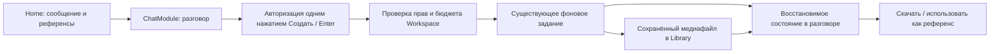

# Home: разговор и создание медиа

21 сентября 2026. Первый срез реализован и запущен локально. Production не обновлялся.
Визуальная основа: [принципы интерфейса](./reverie-interface-principles.md).

## Назначение и границы

Production получает собственный постоянный чат для быстрой генерации: референс и
промпт → готовое изображение без сборки Flow. Flows остаётся способом создать
повторяемый процесс. Продуктовый путь Reverie AI пока открыт и не блокирует Home.

Это уточнение владельца от 21.09.2026 заменяет прежнее предположение, что Home
обязан быть интерфейсом Reverie AI. Notion автоматически не изменялся.
Универсальный разговор остаётся в ChatModule; провайдеры, фоновые задания, assets,
права и учёт расходов — в существующих модулях Production. Второго agent loop,
системы оплаты или фиктивного пустого Flow нет.

## Что работает

| Поверхность | Поведение |
| --- | --- |
| `/` | Стартовый Home: карточки входа в Изображение, Flow, Storyboard и Timeline |
| `/create?type=image` | Отдельный полноэкранный агент и композер изображения; стартовые карточки и боковое меню скрыты |
| `/create?type=text` | Текстовый разговор без стартовых карточек |
| `/create?type=video` | Полноэкранная генерация видео: типизированные кадры/референсы, автоматический способ создания, камера, качество, формат, длительность и звук по возможностям модели |
| `/create?type=storyboard|timeline|flow` | Встроенная конфигурация; документ создаётся только после первого сообщения — [контракт](./production-create-flow.md) |
| `/flows` | Прежняя файловая галерея, шаблоны, проекты, избранное, исполняемые Flow, поиск, сетка/список |
| `/folders`, `/folders/:id` | Проекты с Flow, историями и связанными медиа; [контракт контейнеров](./project-containers.md) |
| Разговор | Сохраняется на сервере для пользователя и Workspace, восстанавливается при возвращении |
| Новый разговор | Новый контекст; прежние результаты и фоновые задания сохраняются |
| Референсы | Загрузка файла или выбор из Library; до трёх JPEG/PNG/WebP, каждый до 8 MiB, оптимизация существующим attachment-контроллером |
| Генерация | Непустое описание + «Создать»/Enter → существующая очередь → изображение в чате и Library; без второго подтверждения |
| Результат | Статус и отмена; по наведению/фокусу — скачивание, полноэкранный просмотр, выделение маски, использование как референса и Library |
| Ошибки доступа | Понятная причина и проверка доступа; отсутствие ключа/бюджета не скрывает историю |

Storyboard, Timeline и Flow открывают общий маршрут создания с отдельными
настройками типа. Это независимые документы, которые можно объединить проектом.
Диктовка и экспорт монтажа не входят в этот срез.

## Переключение режима и видео (21 сентября)

Слева от композера расположена плавающая панель Фото / Видео / Текст по Figma
717:3161. Выбор режима меняет только композер: URL, стартовые карточки и боковая
навигация остаются на месте. Карточка «Изображение» открывает `/create?type=image`,
а «Сначала обсудим идею» выбирает текстовый режим. Отправка из Home также открывает
рабочий экран после непустого запроса кнопкой или Enter и локальной проверки готовности
вложений и параметров. Пустой ввод и заблокированная отправка не вызывают переход.
Открытие сохранённого чата по прямой ссылке по-прежнему сразу показывает его экран.

Переключатель сохраняет текущий разговор, текст и загруженные вложения; параметры
изображения и видео хранятся отдельно в открытой сессии. Во время отправки и
загрузки вложений переключение заблокировано. На узком экране панель становится
горизонтальной над композером. Общие меню используют фон 70% и blur 30 px;
при отключённой прозрачности фон становится сплошным.

Видеокомпозер использует действующий каталог OpenRouter. Доступны только
подтверждённые параметры модели. Способ определяется по слотам: по описанию,
первому/последнему кадрам или референсам. При смешивании кадров с референсами,
последнем кадре без первого или неподдержанных материалах отправка блокируется
с объяснением. Непустой промпт обязателен. Оптика, фактура, зерно, движение и темп
камеры собираются в художественную инструкцию; это не нативные параметры API.
Подробный контракт: [Home video intent](./home-video-intent.md).

`POST /api/chat/v1/home-video-generations` фиксирует пользовательский запрос и
создаёт существующее durable-задание `generate_video` без фиктивного документа.
Сервер проверяет разговор, Workspace, вложения, модель и бюджет. Ключ повтора
сохраняется до подтверждения приёма, поэтому сетевой повтор не создаёт вторую
генерацию. `GET` восстанавливает список заданий и незавершённую постановку того же
запроса в очередь. Результат сохраняется в Library и показывается видеоплеером
в разговоре. Текстовый агент не запускает видео через инструмент изображения.

## Связь разговора с генерацией

Экран изображения следует [Figma 740:10346](https://www.figma.com/design/UA1XIcYdD0DUr5gPCSGUQm/REVERIE-img-prodaction-pipeline?node-id=740-10346):
плавающий полупрозрачный композер с вложенной поверхностью, компактные параметры,
отдельные кнопки героев, референсов и генерации. Меню моделей и большие карточки
выбора подсвечивают иконку голубым градиентом при наведении, фокусе и выборе.
Кнопка возврата открывает Home; текущий разговор, черновик, параметры и герои при
этом сохраняются в открытой сессии. Новый разговор сбрасывает параметры композера.

Модель, формат и размер берутся из действующего каталога. При смене модели
несовместимые параметры заменяются поддерживаемыми. Пиксельный размер показывается
только при наличии таблицы модели; иначе — «Размер по модели».
Герои выбираются из Library текущего Workspace: до трёх паспортов, у каждого
используются описание и основное фото. Пользовательские референсы и фото героев
вместе ограничены четырьмя изображениями и возможностями выбранной модели.

Перед отправкой `POST /api/chat/v1/home-image-settings` сохраняет неизменяемый
снимок параметров и героев. Его селектор включается в исходное сообщение
ChatModule; повтор запроса использует те же параметры. Агент не может незаметно
подменить выбранную модель, формат, размер или убрать референсы. Доступ к
Workspace, разговору, героям и фото проверяется сервером; перед запуском
повторно проверяется доступ к исходникам. Таблица добавляется миграцией `0036`.

Композер использует публичные runtime/attachment API ChatModule и слот
`beforeComposer`; стандартная форма скрывается только на экране изображения.
Для следующего обновления общего пакета нужен публичный слот замены композера,
чтобы убрать зависимость от CSS-класса стандартной формы. Локальной копии движка нет.

`GET /api/chat/v1/home-conversation` возвращает текущий разговор, режим и связанные
задания; `POST` начинает новый. Заголовок `x-workspace-id` — селектор, права
проверяются на сервере. Миграция `0034_home_chat_generation` добавляет связи
разговора и оплачиваемого действия с инициатором, Workspace, turn, job и asset.
Подробности: [ADR Home generation](./adr/home-chat-generation.md).

Режим Текст не получает инструменты изменения канваса или генерации. Режим
Изображение получает каталог моделей и `home_generate_image`; параметры и
референсы фиксируются при отправке. Нажатие «Создать» или Enter с непустым
описанием разрешает одну генерацию; второго подтверждения нет. Старые ожидающие
карточки сохраняют ручное подтверждение. Проверяются текущие membership и доступ
к вложениям. Стоимость заранее не выдумывается: пользователь видит параметры и
предупреждение, что окончательная цена известна после выполнения.

Повтор подтверждения исходного действия возвращает то же задание. Новое сообщение
может создать новый оплачиваемый запуск. Перезагрузка и восстановление разговора
не повторяют запрос к провайдеру. Worker продолжает безопасное восстановление
сохранения по checkpoint; неоднозначный результат запроса запрещает слепой повтор
и показывает пользователю инструкцию с номером задания.

Готовые результаты Home автоматически видны в Library. Другие пути генерации
сохраняют прежние правила видимости. При переключении Workspace разговор и
материалы выбираются заново; существующие Workspace IDs не меняются.

## Проверено локально

Уточнение композера от 21 сентября:

- Без текстовой инструкции «Создать» и Enter не отправляют запрос, даже если есть
  референсы. Сервер проверяет текст исходного сообщения независимо от ответа модели.
- Пользовательское сообщение появляется до сетевой подготовки настроек. После
  приёма ChatModule оно заменяется штатным optimistic-сообщением; при сбое остаётся
  понятная пометка, а текст и вложения доступны для исправления и повтора.
- Герои, локации, объекты и референсы сгруппированы в белой части композера над
  серой областью ввода. Удаление видно по наведению/фокусу, на touch — постоянно.
  Поле автоматически растёт до 220 px, дальше прокручивается.
- Кнопки «Герои» и «Референс» используют общий компонент; кнопки генерации и
  действий монохромные, сообщения агента и карточки инструментов — нейтральные.
- Полноэкранный результат использует общий MediaViewer и редактор маски Canvas.
  «Использовать маску» помещает исходник и чёрно-белую маску в референсы и заполняет
  инструкцию. Генерация начинается только после «Создать». Это редактирование
  через референсы текущей модели, без обещания попиксельного сохранения вне маски.
- 40 целевых тестов параметров, исходного текста, подписанного запуска,
  идемпотентности, восстановления и остановки прошли. Платный провайдер в тестах
  заменён тестовым.
- Разговор со штатным статусом ChatModule `error` снова открывается с прежней
  историей и результатами. Этот статус означает ошибку последнего ответа, а не
  потерю доступа. Архивные/удалённые и чужие разговоры остаются недоступными.
- В браузере проверены пустой ввод/пробелы + Enter, рост поля 44 → 128 px,
  белые карточки, скрытые действия, полноэкранный просмотр и перенос нарисованной
  маски с исходником в композер без отправки платного запроса.

Дополнение для экрана изображения (Figma 740:10346):

- Полноэкранный режим скрывает стартовую страницу и боковую навигацию; после
  уточнения взаимодействия переход выполняется при отправке, а не выборе карточки.
  В предыдущем срезе в браузере проверены модель, формат 9:16, размер 2K, выбор героя, прикрепление
  изображения из Library и возврат с сохранением черновика/формата.
- После чистой перезагрузки новый экран открывается без ошибок в консоли.
- Миграция `0036` применена локально; реальное сохранение/чтение снимка и отказ
  другому пользователю проверены на PostgreSQL. Тестовый снимок удалён.
- 24 серверных регрессионных теста и 3 теста выбора параметров прошли, как и
  typecheck, lint, architecture, size и проверка diff.
- Проверка модели учитывает обычные вложения вместе с фото героев. Окончательная
  проверка использует реальные вложения исходного сообщения. Суммарный JSON/base64
  проверяется до создания задания, чтобы большие изображения не оставляли
  неисполнимые задания в очереди.

Предыдущий срез Home/Flows:

- 22 целевых backend-теста: подтверждение, права, изоляция, идемпотентность,
  восстановление, референсы и сохранение результата; провайдер подменён тестовым.
- 6 тестов состава проектов и выборки связанных медиа.
- Typecheck, lint, architecture и ограничение размера файлов.
- В браузере: Home; перенос шаблонов/галереи в Flows; проект с Flow и 23 связанными
  изображениями; фильтр/список; диалог создания истории; смена режима с сохранением
  черновика; Library picker и успешное прикрепление референса; новый разговор и
  повторное открытие Home после перезагрузки.
- Миграции Stories `0033` и Home `0034` применены к локальной базе. Обработчик
  генераций перезапущен после проверки отсутствия выполняющихся заданий.

Платные запросы к настоящей модели в этом проходе не отправлялись. Полный путь
реальной генерации и качество ответа ассистента ещё требуют пользовательской приёмки.
`check:reverie-ui` содержит прежние отсутствующие токены вне Home/проектов —
см. [навигацию](./production-navigation.md).

## Композер и текстовые сценарии — 21 сентября 2026

Режимы идут в порядке Текст / Фото / Видео. Общая форма, textarea, загрузчик и
переключатели сохраняют DOM при смене режима; меняются только дополнительные
слоты, с коротким выходом/входом и адаптацией высоты. Reduced motion отключает
движение. Под формой находятся только ограничения файлов и подсказка Enter;
ошибки, ограничения бюджета и состояния идут над ней или в разговоре.

Три стартовых сценария — обсудить идею, написать статью, проанализировать
изображения — выбирают текстовый режим и готовят редактируемый запрос. Они не
отправляют запрос и не тратят бюджет до нажатия пользователем «Отправить».
Автоматическая персонализация по истории задач в этот срез не входит.

Текстовый режим использует тот же каталог моделей и параметры, что Generate
Text в Flow: поддерживаемые temperature/reasoning и формат ответа. Перед
отправкой сервер фиксирует настройки в неизменяемом `home_text_settings`,
проверяя владельца беседы, Workspace и allowlist модели. В ChatModule передаётся
только selector ID, не произвольная конфигурация провайдера. Продуктовый gateway
использует существующий OpenRouter adapter, ключ и бюджет Workspace, передаёт
настройки и возвращает нормализованный usage. История, вложения, запросы и
отмена остаются в ChatModule; нового агентного цикла или форка пакета нет.
Неоднозначный платный сбой автоматически не повторяется. Для таблицы нужна
миграция `0038_home_text_and_folder_tree`.

## Неподвижное поле композера

Переключение Фото/Видео сохраняет положение серого поля композера. Анимация
высоты применяется только к верхнему блоку материалов и камеры; форма и textarea
не пересоздаются. На узкой ширине параметры прокручиваются в одну строку,
чтобы дополнительные настройки видео не увеличивали высоту серого поля.
При reduced motion раскрытие происходит сразу. Проверено в локальном браузере:
при раскрытии/сворачивании верхнего блока от 0 до 185 px границы серого поля
оставались неизменными; набранный текст сохранялся между режимами.

Во всех трёх режимах селекторы и строка параметров имеют высоту 32 px,
выбор модели — ширину 180 px. В двухколоночной компоновке нижний отступ кнопок
равен левому отступу серого контейнера: 12 px. Горизонтальная прокрутка
сохранена без полосы и пустого места под ней; фокус клавиатуры виден внутри кнопок. В тексте нет
общего меню настроек и выбора формата ответа: температура и глубина рассуждения
выведены в отдельные liquid-селекторы только при поддержке моделью.
Настройки изображения с единственным значением «Авто» и параметры видео без
вариантов из каталога скрыты; серверная нормализация запросов сохраняется.

## Дальнейшие срезы

- Видео: дальнейшая пользовательская приёмка качества моделей и режиссёрских пресетов.
- Диктовка: работающий захват речи, видимые состояния и запрос разрешения микрофона.
- Общая фильтрация и picker для дополнительных типов материалов.
- Прямая принадлежность произвольного медиа проекту, если потребуется независимо
  от использования в Flow/истории; сейчас проект собирает медиа своих документов.
- Развитие Stories/Timeline описано в их отдельных планах; Home использует их маршруты.

## Ранее выполненная правка Library

В полноэкранную панель Library добавлена кнопка «Скачать» для оригинала, с
блокировкой повторного действия и понятным результатом. Она была проверена
мышью/Enter в локальном браузере и четырьмя тестами library-batch-actions.
