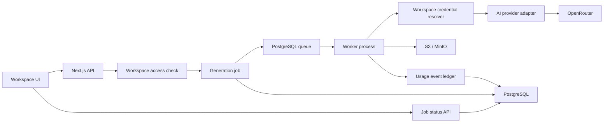

# Workspace AI execution architecture

Дата решения: 2026-07-17
Статус: реализовано в `feat/workspace-ai-execution`, проходит интеграционную проверку

Связанный план: [workspace-ai-execution-implementation-plan.md](./workspace-ai-execution-implementation-plan.md)

## 1. Цель ближайшего этапа

Подготовить закрытый тестовый контур, в котором каждый Workspace:

- подключает собственный OpenRouter API key;
- использует этот ключ для всех AI-операций внутри Workspace;
- видит состояние ключа, его лимиты и расходы;
- получает надежное фоновое выполнение долгих генераций;
- сохраняет нормализованную историю usage без внутренней кредитной системы.

Этап не включает расчет тарифов, внутренний кошелек, списание кредитов, team invitations
и сложную систему динамических feature flags.

## 2. Зафиксированные продуктовые решения

### 2.1 Credential принадлежит Workspace

OpenRouter key и будущие provider credentials принадлежат Workspace, а не отдельному
пользователю.

Причины:

- Workspace является границей данных, документов, ассетов и AI-операций;
- ключ настраивается один раз для всей команды;
- смена состава команды не требует переноса или дублирования credentials;
- будущий executable pipeline запускается от имени Workspace, даже если инициатором
  является внешний сервис, а не пользователь интерфейса;
- usage и provider cost естественно агрегируются на уровне Workspace.

На первом этапе в каждом Workspace поддерживается одно активное подключение OpenRouter.
Модель данных не должна запрещать появление нескольких провайдеров или нескольких
credential versions в будущем.

### 2.2 Доступ во время закрытого тестирования

Динамические feature flags и персональные allowlist сейчас не реализуются.

Правило закрытого теста:

- если у пользователя есть доступ к Workspace;
- и в Workspace настроен действующий OpenRouter key;
- и роль пользователя разрешает запуск AI-операции;
- операция доступна.

Идею DB-backed feature policies фиксируем как возможное будущее расширение, но не
добавляем ее в текущую схему и интерфейс.

### 2.3 Подписка и активный пользователь

В будущем активным считается пользователь с оплаченной предоплатной подпиской.

Роль в Workspace и статус подписки являются разными понятиями:

- роль определяет административные и продуктовые полномочия;
- подписка определяет доступ к созданию и платному execution;
- неоплаченный Creator получает viewer-like режим и предложение оплатить подписку;
- Owner/Admin сохраняет критические полномочия управления Workspace, но AI execution
  без активной подписки недоступен;
- Viewer не запускает платные операции.

Модель кредитов и тарифов проектируется отдельным этапом после расчета экономики.

## 3. Исходное состояние до реализации

До ветки `feat/workspace-ai-execution`:

- OpenRouter key читается из одного `OPENROUTER_API_KEY`;
- HTTP route сам вызывает OpenRouter и ожидает результат;
- `generation_job` хранит статус, попытки, lease, usage и provider cost;
- отдельного queue transport и отдельного worker process нет;
- usage ledger покрывает не все AI-операции;
- в настройках есть только личные разделы Account и Security.

Следовательно, существующий generation orchestrator является полезным доменным
фундаментом, но еще не полноценной фоновой системой исполнения.

В текущей ветке этот разрыв закрыт: key перенесён в Workspace connection,
добавлены provider contract, PostgreSQL queue, отдельный worker, usage events,
настройки Workspace и восстановление image-generation polling после reload.

## 4. Целевая архитектура



На тестовом сервере это один репозиторий и один Docker image, но два процесса:

- `web` обслуживает UI и API;
- `worker` выполняет фоновые задачи.

PostgreSQL и S3 остаются общими. Отдельный микросервис, Redis и отдельная база на
этом этапе не нужны.

## 5. Модульные границы

Новые части реализуются как modular monolith, а не как продолжение одного большого
OpenRouter helper.

```text
src/
  modules/
    provider-connections/
      core/
      contracts/
      adapters/
    generation/
      core/
      contracts/
      adapters/
    usage/
      core/
      contracts/
      adapters/

  platform/
    crypto/
    queue/
    observability/
```

### Core

Содержит бизнес-правила:

- Workspace владеет provider connection;
- кто может менять credential;
- как создается job;
- какие переходы статусов допустимы;
- когда retry разрешен;
- как нормализуется usage.

Core не импортирует OpenRouter, Drizzle или Graphile Worker.

### Contracts

Содержит стабильные DTO и интерфейсы:

- provider requests/results;
- normalized usage;
- error taxonomy;
- credential summary;
- queue command;
- job events;
- timeout/cancel contract.

### Adapters

Содержит конкретные интеграции:

- OpenRouter adapter;
- fake provider для тестов;
- Drizzle repositories;
- encryption adapter;
- PostgreSQL queue adapter.

## 6. Provider contract

Минимальный provider contract должен покрывать:

```text
validateCredential
getCredentialSummary
listModels
execute
getOperationStatus
normalizeUsage
classifyError
```

Provider contract не должен использовать OpenRouter-specific типы на внешней границе.

Нормализованный результат содержит:

- provider operation ID;
- фактически использованную модель;
- modality результата;
- output payload или ссылку на временный артефакт;
- input/output/total tokens;
- provider cost;
- cache/reasoning usage, если доступно;
- исходный provider metadata в ограниченном техническом поле;
- retry/reconciliation classification.

## 7. Workspace provider connection

Предлагаемая логическая модель:

```text
workspace_provider_connection
  id
  workspace_id
  provider
  status
  active_credential_version
  masked_label
  provider_metadata
  last_validated_at
  last_synced_at
  last_error_code
  created_by_user_id
  created_at
  updated_at

workspace_provider_credential
  id
  connection_id
  version
  encrypted_secret
  secret_fingerprint
  encryption_key_version
  activated_at
  revoked_at
  created_by_user_id
```

Разделение connection и credential version позволяет безопасно менять ключ без
потери истории и без хранения secret в generation job.

При старте worker:

1. загружает активную connection Workspace;
2. расшифровывает текущую credential version;
3. записывает фактически использованную version в job attempt;
4. вызывает provider adapter;
5. очищает secret из памяти после вызова.

## 8. Шифрование и безопасность

Для однохостового тестового контура:

- AES-256-GCM;
- отдельный `PROVIDER_CREDENTIALS_MASTER_KEY` в runtime secrets;
- ciphertext, IV/auth tag и key version в PostgreSQL;
- master key не хранится в базе и не попадает в database backup;
- secret никогда не возвращается после сохранения;
- UI получает только masked label;
- request body с ключом не логируется;
- ошибки не содержат secret или полный upstream response;
- новый ключ сначала валидируется, затем активируется транзакционно;
- старый ключ отзывается только после успешной активации нового.

В production crypto adapter можно заменить на KMS/Vault без изменения core.

## 9. Настройки Workspace

Provider connection размещается не в личном профиле, а в настройках активного
Workspace:

```text
Settings
  Account
  Security
  Workspace
    General
    AI Providers
```

Раздел `AI Providers` для OpenRouter показывает:

- connected/disconnected/invalid;
- masked key label;
- кто и когда обновил подключение;
- Connect, Validate, Replace, Disconnect;
- limit, remaining и reset policy ключа;
- usage daily/weekly/monthly/all-time;
- дату последней синхронизации;
- локальный usage Reverie по моделям и операциям.

Полный secret после сохранения не показывается.

Owner и Admin могут управлять connection. Creator может выполнять разрешенные
операции, но не читать и не менять credential. Viewer не запускает execution.

## 10. Queue и worker

На ближайшем этапе используется собственная минимальная PostgreSQL-backed queue
поверх `generation_job`. Этого достаточно для одного хоста и не добавляет второй
инфраструктурный компонент. Очередь имеет атомарный claim через row lock,
lease/heartbeat, persisted backoff, fenced attempt и graceful shutdown.

`generation_job` одновременно является продуктовой записью, очередью и source of
truth для UI, usage и audit. При росте нагрузки transport можно заменить на
Graphile Worker или отдельный брокер, сохранив provider/executor contracts.

Job payload содержит только идентификаторы:

- generation job ID;
- workspace ID;
- provider connection ID;
- operation;
- request payload reference.

Secret в queue payload не записывается.

HTTP API возвращает `202 Accepted`, `jobId` и `statusUrl`. На первом этапе frontend
использует polling. SSE/websocket добавляется только при реальной необходимости.

## 11. Retry и reconciliation

Delivery является at-least-once, поэтому все handlers обязаны быть idempotent.

Ошибки разделяются:

- validation, forbidden, invalid credential — permanent;
- explicit rate limit и подтвержденный temporary upstream failure — retryable;
- timeout после возможной отправки провайдеру — ambiguous;
- provider success без требуемого payload — reconciliation или controlled failure.

Ambiguous operation нельзя слепо повторять: провайдер мог уже списать средства.
До HTTP-вызова worker сохраняет `provider_dispatched_at` и номер attempt. Успешный
provider result сохраняется в S3 как отдельный `result-attempt-N.json` до публикации
Library asset. Поэтому после crash новый worker сначала ищет checkpoint, а не вызывает
провайдера повторно.

Если OpenRouter вернул provider operation ID, worker и фоновый reconciler получают
финальный usage через generation status API. Если после dispatch нет ни operation ID,
ни checkpoint, job закрывается с `provider_outcome_unknown`: это консервативное
решение, которое важнее автоматического retry, потому что исключает скрытый повторный
платный вызов.

Статус job и публикация готового generated asset выполняются в одной PostgreSQL
transaction. Cancel или потеря lease не позволяют позднему worker сделать скрытый
asset видимым.

Для CI provider contract выполняется через fake adapter с именем `openrouter`.
Он возвращает валидный минимальный PNG и детерминированный usage, поэтому smoke
проверяет настоящие API, очередь, отдельный worker, S3 и Library без внешних
расходов. Runtime guard разрешает этот adapter только при `CI=true` или
`NODE_ENV=test`; обычный локальный и production runtime всегда создаёт реальный
OpenRouter adapter.

## 12. Usage и будущая бухгалтерия

`generation_job` описывает состояние задачи. Отдельный append-only `usage_event`
описывает фактически потраченные ресурсы. Если OpenRouter дополняет usage позднее,
reconciliation event с большим `call_index` заменяет неполную версию этого же attempt
в пользовательских агрегатах, не уничтожая исходную audit-запись.

Usage event должен быть связан с:

- Workspace;
- пользователем-инициатором;
- job/attempt;
- document и node, если есть;
- provider/model/operation;
- token usage;
- provider cost;
- будущими pipeline run и node run.

Internal credits, wallet и тарифные вычисления в этот этап не входят. В будущем
credit ledger будет потреблять нормализованные usage events, а не переписывать
generation jobs.

## 13. Не входит в ближайшую реализацию

- team invitation UI;
- динамические feature flags;
- тарифный каталог;
- платежный провайдер;
- credit wallet и списания;
- platform-funded OpenRouter keys;
- executable pipeline runtime;
- отдельный Redis;
- отдельный AI microservice;
- сложная streaming-инфраструктура.

Эти ограничения уменьшают текущую сложность, но provider contract, usage events и
queue adapter сохраняют возможность добавить перечисленные функции позже.

## 14. Официальные технические источники

- OpenRouter key limits and usage:
  https://openrouter.ai/docs/api/reference/limits
- OpenRouter usage accounting:
  https://openrouter.ai/docs/cookbook/administration/usage-accounting
- OpenRouter OAuth PKCE:
  https://openrouter.ai/docs/guides/overview/auth/oauth
- OpenRouter Management API Keys:
  https://openrouter.ai/docs/guides/overview/auth/management-api-keys
- Graphile Worker:
  https://worker.graphile.org/
